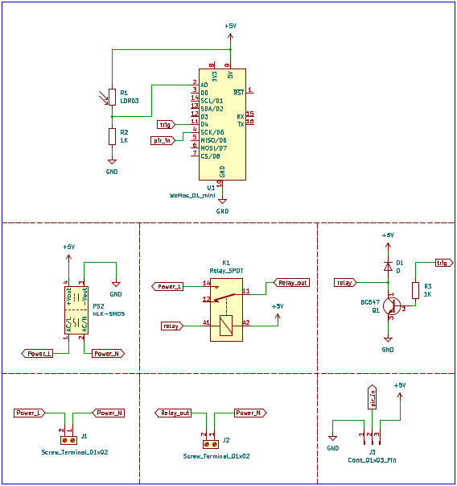
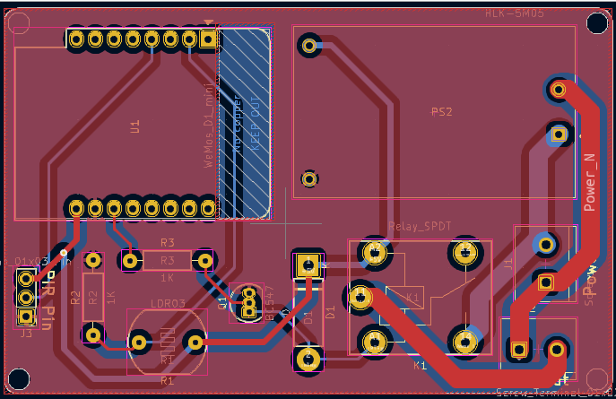
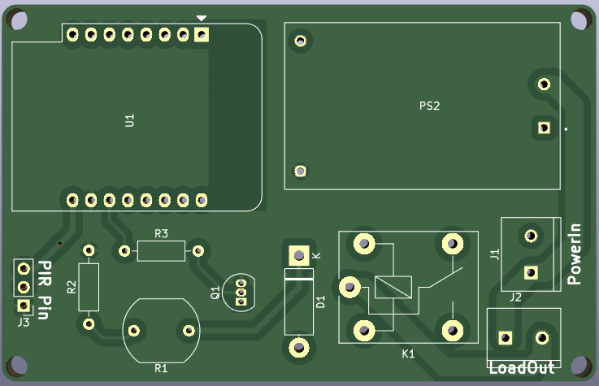
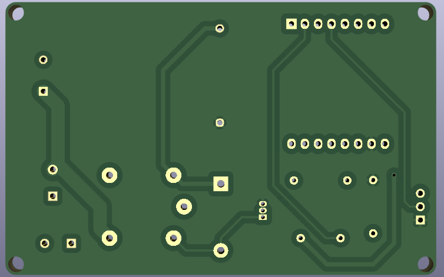

# Night light control system based on PIR sensor and ESP32.

A clone version of the project done by @alphaseneca. Initial project link: https://github.com/alphaseneca/stairlight_controller/tree/master

## Schematic

## PCB Layout

## Live Preview

